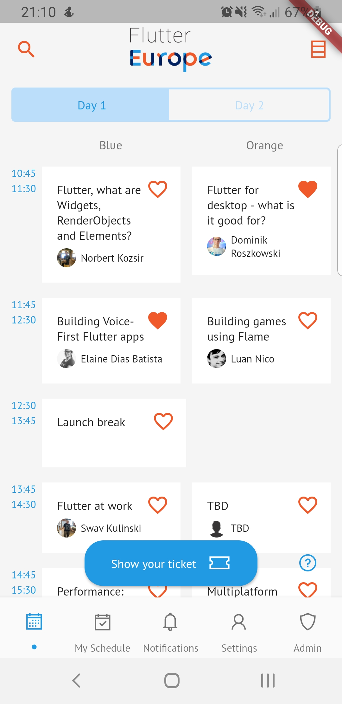
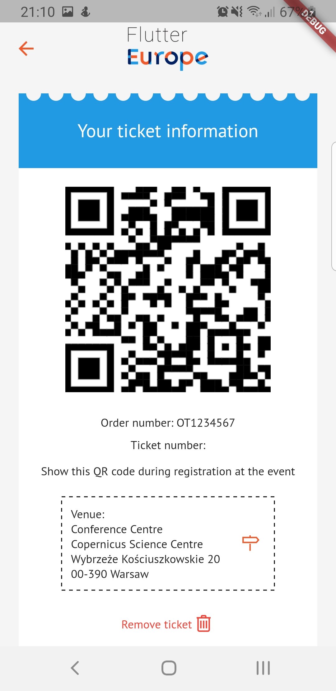
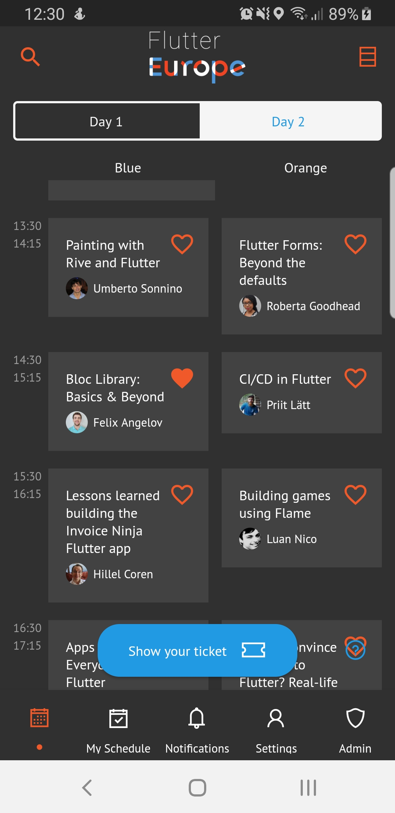
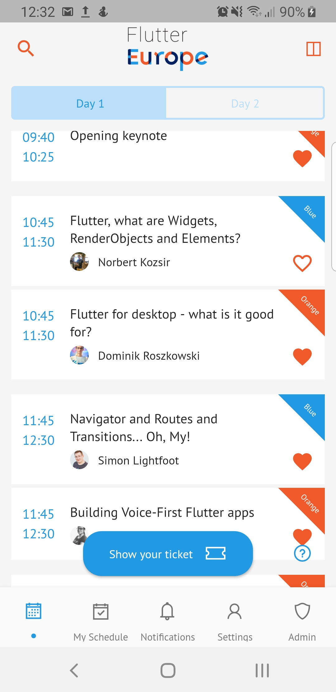

# Flutter Europe conference app

| Deploy to Firebase | Tests | Deploy to stores |
|--------------------|-------|------------------|
| [](https://codemagic.io/apps/5dad72c1db229636b8c072a6/5dad72c1db229636b8c072a5/latest_build) | [](https://codemagic.io/apps/5dad72c1db229636b8c072a6/5dad72c1db229636b8c072a5/latest_build) | [](https://codemagic.io/apps/5dad72c1db229636b8c072a6/5db3500825dc3f4dd757c499/latest_build) |

This is repository of [Flutter Europe](https://fluttereurope.dev/) official conference app.


| Agenda | Ticket | Dark Mode | Different layouts |
|--------------------|-------|--------|--------|
| |  |  |  |

| Google Play | AppStore |
|---|---|
| [](https://play.google.com/store/apps/details?id=dev.fluttereurope.conferenceapp) | [](https://apps.apple.com/us/app/flutter-europe/id1485095896) |

## Getting Started

This simple conference app allows:

- [x] displaying the agenda of the event
- [x] adding and showing favorite talks
- [x] showing details of the talk and speaker
- [x] adding and showing the attendee ticket (via order number or ticket number)
- [x] receiving notifications from organizers
- [x] light/dark mode
- [x] rating of the talks
- [x] feedback gathering
- [x] receiving reminders about the talks
- [ ] adding ticket to the device wallet
- [x] admin mode to send notifications and new users
- [x] crash reporting

It's built with Flutter for iOS and Android.

### Running and building

**Warning** This project is developed on **Flutter dev channel**.

This project is based on 3 flavors: `dev`, `tst` and `prod`. In order to run given flavor in VS Code you should define custom `launch.json` file.

**You need to provide your Google Services** configuration files for iOS and Android.

Project also contains custom `fastlane` configuration for Android and iOS. In case of iOS configuration it's able to set provisioning profiles, archive and deploy app to Firebase App Distribution or Testflight. In case of Android it's used only to distribute app to Firebase App Distribution and Google Play.

## Project plan

You can follow project updates in the respective [MVP project](https://github.com/FlutterEurope/conference2020/projects/1).

## Contributing

If you want to contribute, please contact us directly.

If you want to get access to our Contentful and Firebase backends, please let us know directly.

### Generating model

We're using json_serializable:

```
flutter pub run build_runner build --define "json_serializable=any_map=true" --delete-conflicting-outputs
```
